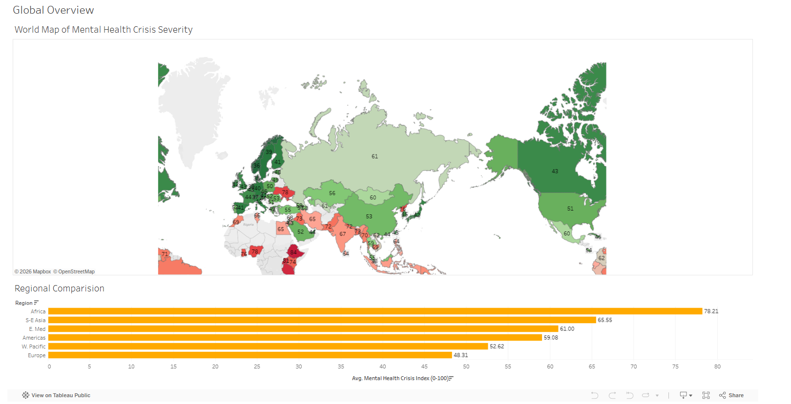
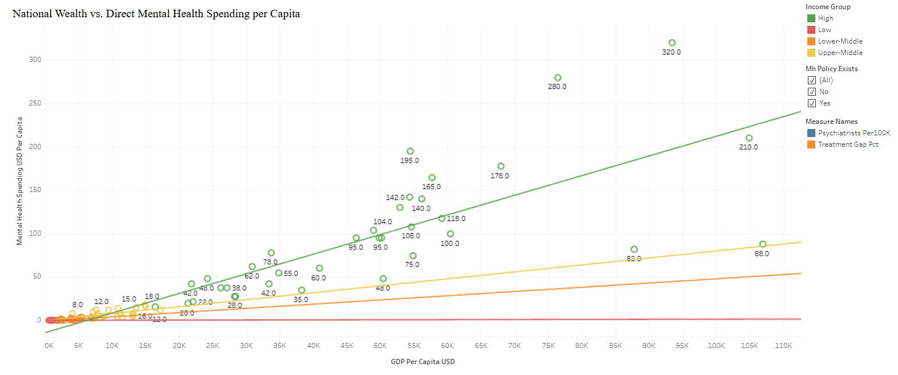
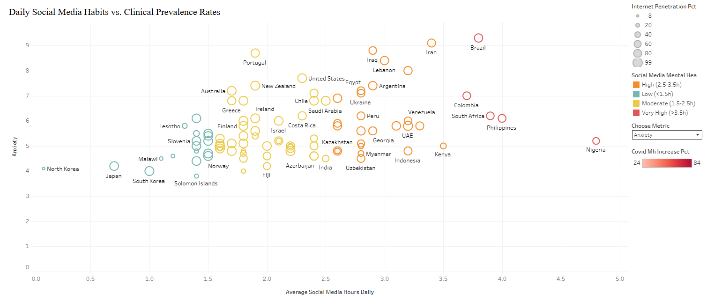

# 🌍 Global Mental Health Crisis Index 2026: An Interactive Data Story

This repository features an interactive, end-to-end Data Story built in Tableau utilizing the **Global Mental Health Crisis Index 2026** dataset. Instead of separate, disjointed views, this project is structured chronologically into a single, unified interactive presentation that guides the viewer from macro-level global trends down to micro-level modern lifestyle drivers.

## 🔗 Live Interactive Presentation
👉 **[Click here to launch the full Interactive Data Story on Tableau Public](https://public.tableau.com/app/profile/vijay.nakirikanti/viz/WorldMentalHealthDashboard/Story1)**

---

## 📖 Storyboard Walkthrough

### Slide 1: Global Overview & Demographics
*   **Objective:** Identify which regions and income groups face the highest overall mental health burden.
*   **Visualizations:** Choropleth Map paired with a Sorted Regional Bar Chart utilizing mutual dashboard filtering.
  

### Slide 2: Infrastructure & The Treatment Gap
*   **Objective:** Evaluate if financial healthcare investments and medical workforce scale effectively to minimize the untreated care gap.
*   **Visualizations:** Logarithmic Wealth-vs-Spending Scatter Plot alongside a dual-axis Psychiatrist Count vs. Treatment Gap percentage combo chart.

### Slide 3: Modern Drivers & Post-Pandemic Shocks
*   **Objective:** Analyze the relationship between daily social media usage and clinical prevalence rates, alongside tracking the lingering impact of the COVID-19 pandemic surge.
*   **Visualizations:** Variable-sized bubble matrix driven by a dynamic parameter dropdown (allowing on-the-fly toggling between Depression and Anxiety metrics) nested alongside regional post-pandemic escalation rankings.

---

## 🛠️ Data & Technical Skills Demonstrated
*   **Advanced Tableau Architecture:** Designed a unified Tableau Story to control user flow and optimize data real estate.
*   **Dynamic UI Controls:** Implemented custom Parameters for interactive axis-swapping and Dashboard Actions for synchronized visual filtering.
*   **Socioeconomic Analytics:** Applied continuous variable transformations (Logarithmic scaling) to account for global economic disparities and data compression.
